# CLAUDE.md

This file provides guidance to Claude Code (claude.ai/code) when working with code in this repository.

## Change Log

### 2025-02-03
- Updated root-level documentation with enhanced architecture overview
- Added module structure diagram (Mermaid)
- Integrated existing `llmdoc/` documentation system references
- Created `.claude/index.json` for AI context tracking

## Quick Reference

### First Steps for AI Agents
1. **Read this file** for project overview
2. **Consult `llmdoc/index.md`** for comprehensive documentation navigation
3. **Use the Mermaid diagram below** to understand module relationships

## Project Vision

**React Spreadsheet** is a performant, customizable React component library providing Excel-like spreadsheet functionality. The library emphasizes:
- **Simple API** focusing on common use cases while maintaining flexibility
- **Performance optimization** through optional virtualization and efficient state management
- **Component composition** following the "Just Components" philosophy
- **Type safety** with full TypeScript support
- **Extensibility** through component override patterns and formula engine customization

## Architecture Overview

The codebase follows a clean layered architecture with separation of concerns across four main layers:

```mermaid
graph TD
    A["(root) react-spreadsheet"] --> B["src/"];
    B --> C["components/"];
    B --> D["state/"];
    B --> E["engine/"];
    B --> F["core/"];
    B --> G["stories/"];

    C --> C1["Spreadsheet.tsx - Main Orchestrator"];
    C --> C2["Cell, ActiveCell - Grid Cells"];
    C --> C3["DataViewer, DataEditor - Edit/View Modes"];
    C --> C4["Table, Row, HeaderRow - Layout"];
    C --> C5["Indicators - Row/Column Headers"];
    C --> C6["VirtualizedTable.tsx - Performance"];

    D --> D1["reducer.ts - State Management"];
    D --> D2["actions.ts - Action Creators"];
    D --> D3["context.ts - React Context"];
    D --> D4["use-selector.ts - Optimized Hooks"];

    E --> E1["engine.ts - Model Class"];
    E --> E2["formula.ts - Formula Parser"];
    E --> E3["point-graph.ts - Dependency Tracking"];
    E --> E4["point-set.ts - Cell Collections"];

    F --> F1["matrix.ts - 2D Grid Data"];
    F --> F2["selection.ts - Selection Classes"];
    F --> F3["point-range.ts - Range Operations"];
    F --> F4["point.ts - Coordinates"];

    click C "D:\Project\react-spreadsheet\src\components\README.md" "Component Layer Docs"
    click D "D:\Project\react-spreadsheet\src\state\README.md" "State Management Docs"
    click E "D:\Project\react-spreadsheet\src\engine\README.md" "Engine Layer Docs"
    click F "D:\Project\react-spreadsheet\src\core\README.md" "Core Data Structures Docs"
```



## Module Index

| Module | Path | Responsibility | Language | Documentation |
|--------|------|----------------|----------|---------------|
| **Component Layer** | `src/components/` | React UI components with HOC enhancement pattern | TypeScript | [llmdoc/architecture/component-layer.md](llmdoc/architecture/component-layer.md) |
| **State Management** | `src/state/` | Redux-style reducer with React Context optimization | TypeScript | [llmdoc/architecture/state-management.md](llmdoc/architecture/state-management.md) |
| **Engine Layer** | `src/engine/` | Formula evaluation, dependency tracking, Model class | TypeScript | [llmdoc/architecture/engine-layer.md](llmdoc/architecture/engine-layer.md) |
| **Core Data Structures** | `src/core/` | Immutable Matrix, Selection, Point, PointRange | TypeScript | [llmdoc/architecture/core-data-structures.md](llmdoc/architecture/core-data-structures.md) |
| **Stories** | `src/stories/` | Storybook stories for component visualization | TSX | [Storybook](http://localhost:6006) |
| **Documentation** | `llmdoc/` | Comprehensive LLM-friendly documentation | Markdown | [llmdoc/index.md](llmdoc/index.md) |
| **Website** | `website/` | Docusaurus documentation site | TS/MDX | [Online Docs](https://iddan.github.io/react-spreadsheet/docs) |

## Common Commands

### Development
```bash
# Build CJS and ES modules to dist/
yarn build

# Run linters (ESLint + Stylelint)
yarn lint

# Format code with Prettier
yarn format

# Run Jest tests
yarn test

# Run specific test
yarn test -t "testName"

# Run tests with coverage
yarn test:coverage

# TypeScript type checking
yarn check-typing

# Full CI pipeline
yarn ci

# Start Storybook dev server (port 6006)
yarn storybook

# Build static Storybook
yarn build-storybook
```

## Key Architecture Patterns

### 1. Component Layer (`src/components/`)

**Entry Point:** `src/components/Spreadsheet.tsx`

The Spreadsheet component is the main orchestrator that:
- Uses React's `useReducer` hook for state management
- Provides React Context via `use-context-selector` for optimized re-renders
- Implements HOC enhancement pattern for injecting state into child components
- Supports component overrides via props (Cell, DataViewer, DataEditor, Table, Indicators)
- Handles keyboard events, clipboard operations, and mouse interactions

**Key Components:**
- `Spreadsheet.tsx` - Main container with state management
- `Cell.tsx`, `ActiveCell.tsx` - Individual cell rendering
- `DataViewer.tsx`, `DataEditor.tsx` - View/edit mode components
- `Table.tsx`, `Row.tsx`, `HeaderRow.tsx` - Layout components
- `RowIndicator.tsx`, `ColumnIndicator.tsx`, `CornerIndicator.tsx` - Header components
- `VirtualizedTable.tsx` - Performance-optimized version using react-window

### 2. State Management (`src/state/`)

**Pattern:** Redux-style reducer with React Context

**Key Files:**
- `reducer.ts` - Main reducer with 20+ action types
- `actions.ts` - Action creators (setData, select, activate, copy, paste, etc.)
- `context.ts` - React Context with use-context-selector optimization
- `use-selector.ts` - Custom hooks for efficient state consumption

**StoreState Shape:**
```typescript
{
  model: Model,              // Spreadsheet data with formula evaluation
  selected: Selection,       // Current selection (range/row/column/worksheet)
  copied: PointRange | null, // Clipboard state
  hasPasted: boolean,
  cut: boolean,
  active: Point | null,      // Currently active cell
  mode: 'view' | 'edit',     // Current mode
  rowDimensions: Record<number, {height, top}>,
  columnDimensions: Record<number, {width, left}>,
  dragging: boolean,
  lastChanged: Point | null,
  lastCommit: CellChange[] | null
}
```

### 3. Engine Layer (`src/engine/`)

**Entry Point:** `src/engine/index.ts`

**Model Class:**
- Wraps spreadsheet data with formula evaluation capabilities
- Maintains two data representations: `data` (raw) and `evaluatedData` (computed)
- Tracks formula dependencies via `PointGraph`
- Detects circular dependencies and marks cells with `FormulaError.REF`

**Formula Processing:**
- Uses `fast-formula-parser` library
- Values starting with `=` are treated as formulas
- Evaluates formulas in topological order (BFS traversal)
- Supports cell references (e.g., `=A1`, `=B2+C3`)
- Auto-recomputes dependent cells on value changes

**Key Files:**
- `engine.ts` - Model class and update logic
- `formula.ts` - Formula parsing and evaluation
- `point-graph.ts` - Immutable directed graph for dependency tracking
- `point-set.ts` - Immutable set of Points
- `point-hash.ts` - Point hashing utilities

### 4. Core Data Structures (`src/core/`)

**Matrix<T>:** Immutable 2D array type with operations:
- `get(point, matrix)` - Get cell value
- `set(point, value, matrix)` - Set single cell (immutable)
- `setMultiple(entries, matrix)` - Batch set (optimized for performance)
- `slice(start, end, matrix)` - Extract subrange
- `map(fn, matrix)` - Transform all cells
- `entries(matrix)` - Iterator over [point, value] pairs
- `join(matrix)` - Convert to TSV string
- `split(text)` - Parse TSV string to Matrix

**Selection Hierarchy:**
```
Selection (abstract)
├── EmptySelection
├── RangeSelection
└── EntireSelection (abstract)
    ├── EntireWorksheetSelection
    └── EntireAxisSelection (abstract)
        ├── EntireRowsSelection
        └── EntireColumnsSelection
```

**Coordinate Types:**
- `Point` - {row, column} coordinate
- `PointRange` - Range between two Points with iteration and masking

## Performance Considerations

1. **Batch Operations:** Always use `Matrix.setMultiple()` instead of multiple `Matrix.set()` calls
2. **Formula Evaluation:** Cells are evaluated in dependency order via BFS traversal
3. **Context Optimization:** `use-context-selector` prevents unnecessary re-renders
4. **Virtualization:** Enable `virtualization` prop for large datasets (>1000 cells)
5. **Range Caching:** Dimension calculations are cached in WeakMaps

## Testing Strategy

- **Co-located Tests:** Test files alongside source files (e.g., `engine.test.ts`)
- **Jest Configuration:** Defined in `package.json` with ts-jest preset
- **Test Setup:** `src/jest-setup.ts` for global test configuration
- **Coverage:** Run `yarn test:coverage` for coverage reports
- **Storybook:** Visual testing via `yarn storybook`

## Type System

All types defined in `src/types.ts`:

**Core Types:**
- `CellBase<Value>` - Base cell type with value, readOnly, className, custom components
- `StoreState<Cell>` - Complete state shape
- `Mode` - 'view' | 'edit'

**Component Props:**
- `CellComponentProps`, `DataViewerProps`, `DataEditorProps`
- `TableProps`, `RowProps`, `HeaderRowProps`
- `RowIndicatorProps`, `ColumnIndicatorProps`, `CornerIndicatorProps`

**Component Types:**
- `CellComponent`, `DataViewerComponent`, `DataEditorComponent`
- `TableComponent`, `RowComponent`, `HeaderRowComponent`
- `RowIndicatorComponent`, `ColumnIndicatorComponent`, `CornerIndicatorComponent`

**Configuration:**
- `VirtualizationConfig` - react-window configuration

## Public API

**Main Export:** `src/index.ts`

```typescript
// Default export
export { default } from './components/Spreadsheet'

// Components
export { DataEditor, DataViewer } from './components/...'
export { VirtualizedTable, useVirtualization } from './components/...'

// Utilities
export { createEmpty as createEmptyMatrix } from './core/matrix'

// Selection classes
export {
  Selection,
  EmptySelection,
  RangeSelection,
  EntireRowsSelection,
  EntireColumnsSelection,
  EntireWorksheetSelection
} from './core/selection'

// Types
export { PointRange } from './core/point-range'
export type { Point } from './core/point'
export type { Matrix } from './core/matrix'

// All types from types.ts
export type {
  CellBase,
  CellDescriptor,
  Mode,
  Dimensions,
  CellChange,
  CellComponentProps,
  DataViewerProps,
  DataEditorProps,
  // ... etc
} from './types'

// Engine
export { Model, createFormulaParser } from './engine'
```

## Documentation System

The project includes comprehensive LLM-friendly documentation in `llmdoc/`:

### Navigation
- **Start:** [llmdoc/index.md](llmdoc/index.md) - Main documentation index
- **Overview:** [llmdoc/overview/](llmdoc/overview/) - High-level project context
- **Architecture:** [llmdoc/architecture/](llmdoc/architecture/) - Implementation details
- **Guides:** [llmdoc/guides/](llmdoc/guides/) - How-to guides
- **Reference:** [llmdoc/reference/](llmdoc/reference/) - Quick lookup information

### Key Documentation Files
- [Project Overview](llmdoc/overview/project-overview.md) - Library purpose and features
- [Component Layer Architecture](llmdoc/architecture/component-layer.md) - React component structure
- [State Management Architecture](llmdoc/architecture/state-management.md) - Reducer pattern details
- [Engine Layer Architecture](llmdoc/architecture/engine-layer.md) - Formula evaluation system
- [Public API Reference](llmdoc/reference/public-api.md) - Exported components and types

## AI Usage Guidelines

### When Working on This Codebase

1. **First-Time Setup:**
   - Read this CLAUDE.md for overview
   - Consult [llmdoc/index.md](llmdoc/index.md) for detailed documentation
   - Use the Mermaid diagram to understand module relationships

2. **Feature Development:**
   - Read relevant architecture documents in `llmdoc/architecture/`
   - Check existing patterns in similar components
   - Follow immutable data patterns (spread operators, Matrix.setMultiple)
   - Add co-located tests for new functionality

3. **Bug Fixes:**
   - Use [llmdoc/guides/](llmdoc/guides/) for step-by-step procedures
   - Run `yarn test -t "relatedTest"` to verify fixes
   - Check TypeScript types with `yarn check-typing`

4. **Performance Optimization:**
   - Use `Matrix.setMultiple()` for batch updates
   - Enable virtualization for large datasets
   - Profile with React DevTools to identify re-render issues

5. **Documentation Updates:**
   - Update relevant files in `llmdoc/` when changing architecture
   - Add JSDoc comments for new public APIs
   - Update this CLAUDE.md for high-level changes

## External Resources

- **GitHub:** https://github.com/iddan/react-spreadsheet
- **Demo:** https://iddan.github.io/react-spreadsheet
- **Online Docs:** https://iddan.github.io/react-spreadsheet/docs
- **Storybook:** https://iddan.github.io/react-spreadsheet/storybook
- **npm Package:** https://www.npmjs.com/package/react-spreadsheet

## Dependencies

### Runtime Dependencies
- `react` >=16.8.0 - Peer dependency
- `react-dom` >=16.8.0 - Peer dependency
- `scheduler` >=0.19.0 - Peer dependency
- `fast-formula-parser` ^1.0.19 - Formula evaluation
- `react-window` ^2.2.6 - Virtualization
- `use-context-selector` ^2.0.0 - Optimized context
- `classnames` ^2.5.1 - CSS class utilities

### Development Dependencies
- TypeScript ^5.9.3 - Type system
- Jest ^30.2.0 - Testing framework
- Rollup ^4.57.1 - Bundler
- Storybook ^8.6.15 - Component documentation
- ESLint, Stylelint, Prettier - Code quality tools
